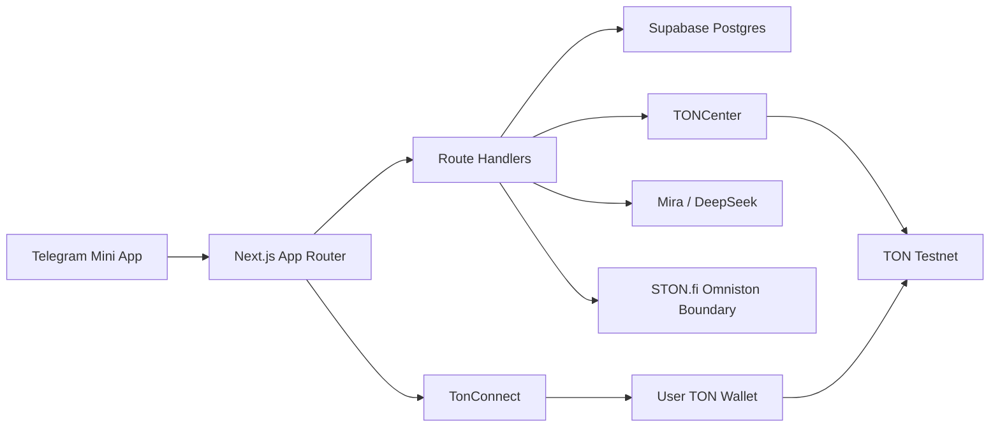

<div align="center">
  

  # WorkPay

  **Telegram Mini App for TON-native freelance escrow, wallet identity, AI risk review, and payment proof.**

  <a href="https://workpay-ton-fixed.vercel.app/launch/3b983d8">Open Mini App</a>
  ·
  <a href="https://t.me/GetWorkPayBot">Telegram Bot</a>
  ·
  <a href="https://workpay-ton-fixed.vercel.app/tonconnect-manifest.json">TonConnect Manifest</a>

  <br />
  <br />

  
  
  
  
  
  

</div>

---

## Language / Язык

> Looking for the Russian version of this documentation?
>
> RU: [Читать документацию на русском](#workpay-ru)

---

## Overview

**WorkPay** is a hackathon-ready Telegram Mini App that turns freelance work into a verifiable TON-native flow.

Telegram is the interface and identity source. TON is the wallet identity and payment proof layer. Supabase stores profiles and product data. Mira reviews job and deal risk. STON.fi is the planned liquidity layer for swap-based settlement.

WorkPay is intentionally honest: it prepares real transactions, verifies real Telegram data, and refuses to fake TON funding, STON.fi swap success, or payment confirmations.

---

## Live Demo

| Surface | Status | URL |
| --- | --- | --- |
| Telegram bot | Live | [`@GetWorkPayBot`](https://t.me/GetWorkPayBot) |
| Mini App launch | Live | [`/launch/3b983d8`](https://workpay-ton-fixed.vercel.app/launch/3b983d8) |
| Production app | Live | [`workpay-ton-fixed.vercel.app`](https://workpay-ton-fixed.vercel.app) |
| TonConnect manifest | Live | [`/tonconnect-manifest.json`](https://workpay-ton-fixed.vercel.app/tonconnect-manifest.json) |
| Network mode | Testnet-first | `NEXT_PUBLIC_TON_NETWORK=testnet` |

---

## What Is Real Now

- Telegram Mini App launch through `@GetWorkPayBot`.
- Server-side Telegram `initData` verification.
- Telegram profile sync into Supabase.
- TonConnect provider and public manifest.
- TON wallet save into user profile.
- Server-side wallet gates for critical actions.
- Energy spending rules and duplicate application protection.
- Marketplace, applications, and deal creation architecture.
- Real TonConnect transaction preparation when escrow env is configured.
- TON transfer payload with `workpay:<dealId>` text comment.
- TONCenter verification boundary that checks:
  - Telegram identity
  - saved wallet
  - escrow destination
  - sender wallet
  - amount
  - network
  - WorkPay reference
- Mira/DeepSeek structured AI review route.
- STON.fi Omniston package readiness without fake swap success.

---

## What Is Setup-Required

- Real escrow funding requires `ESCROW_WALLET_ADDRESS`, `TONCENTER_API_KEY`, a connected testnet wallet, and a real testnet transaction hash.
- STON.fi Omniston quote, swap build, and trade tracking require full provider wiring before enabling `STONFI_ENABLED=true`.
- Mainnet is disabled by default and must stay disabled until escrow and verification are production-ready.
- Smart-contract escrow custody is not claimed by this demo build.

---

## Architecture



| Layer | Technology |
| --- | --- |
| Frontend | Next.js 15, React 19, TypeScript, TailwindCSS |
| Telegram | Telegram Mini Apps WebApp runtime, grammY |
| Wallet | TonConnect UI React |
| TON | `@ton/core`, TONCenter verification boundary |
| Database | Supabase PostgreSQL |
| AI | Mira provider boundary, DeepSeek-compatible adapter |
| Liquidity | STON.fi Omniston package boundary |
| Deployment | Vercel |

---

## Demo Journey

1. Open [`@GetWorkPayBot`](https://t.me/GetWorkPayBot).
2. Tap **Open WorkPay**.
3. Telegram profile appears from Telegram data.
4. Complete the first-run onboarding.
5. Connect TON wallet through TonConnect.
6. Browse marketplace jobs.
7. Apply with Energy.
8. Client accepts an application.
9. Deal is created.
10. Open payment panel.
11. Prepare a Direct TON transaction.
12. Wallet signs and sends on testnet.
13. Paste tx hash.
14. Backend verifies through TONCenter.
15. Open receipt.

---

## Project Structure

```text
app/
  api/                    Next.js route handlers
  launch/[version]/       Telegram cache-busted entry
  tonconnect-manifest...  TonConnect manifest route
components/
  mobile/                 Mini App UI
lib/
  api/                    API contracts and validation
  bot/                    Telegram bot setup
  mira/                   AI review providers
  stonfi/                 STON.fi boundaries
  telegram/               initData verification
  ton/                    TON address, transaction, verification
supabase/
  migrations/             Database foundation
tests/
  *.test.ts               Unit tests
```

---

## Environment

Copy `.env.example` to `.env.local`.

```bash
NEXT_PUBLIC_APP_URL=
NEXT_PUBLIC_APP_VERSION=
NEXT_PUBLIC_DEMO_MODE=true
NEXT_PUBLIC_TON_NETWORK=testnet
NEXT_PUBLIC_ENABLE_MAINNET=false
NEXT_PUBLIC_TONCONNECT_MANIFEST_URL=

NEXT_PUBLIC_SUPABASE_URL=
NEXT_PUBLIC_SUPABASE_ANON_KEY=
SUPABASE_SERVICE_ROLE_KEY=

TELEGRAM_BOT_TOKEN=
TELEGRAM_BOT_USERNAME=GetWorkPayBot
BOT_WEBHOOK_SECRET=

ESCROW_WALLET_ADDRESS=
TONAPI_KEY=
TONCENTER_API_KEY=

STONFI_API_URL=
STONFI_ENABLED=false

MIRA_API_URL=
MIRA_API_KEY=
DEEPSEEK_API_KEY=
DEEPSEEK_BASE_URL=https://api.deepseek.com
DEEPSEEK_MODEL=deepseek-v4-flash
```

---

## Local Development

Use `npm.cmd` on Windows.

```bash
npm.cmd install
npm.cmd run dev
```

Run tests and production build:

```bash
npm.cmd test
npm.cmd run typecheck
npm.cmd run build
```

Run bot locally with polling:

```bash
npm.cmd run bot:dev
```

Configure production bot:

```bash
npm.cmd run bot:setup
```

Telegram Mini Apps require a public HTTPS URL. Use Vercel or a tunnel for Telegram-facing testing.

---

## Telegram Integration

WorkPay uses Telegram only as a trusted source after server verification.

- Frontend reads raw `initData`.
- Backend verifies `initData` with `TELEGRAM_BOT_TOKEN`.
- Backend upserts Telegram profile fields into Supabase.
- `initDataUnsafe` is never trusted for backend authorization.

Current bot state:

```text
Bot: @GetWorkPayBot
Menu: https://workpay-ton-fixed.vercel.app/launch/3b983d8
Webhook: https://workpay-ton-fixed.vercel.app/api/bot/webhook
Pending updates: 0
Last webhook error: null
```

---

## TON Integration

TonConnect setup:

- public app URL
- public TonConnect manifest
- public icon URL
- client-only TonConnect provider
- testnet wallet for demo

Direct payment verification:

1. Server prepares a TonConnect transaction.
2. Transaction contains a TON text comment payload: `workpay:<dealId>`.
3. Wallet approval does not mark funding complete.
4. Backend verifies tx hash through TONCenter.
5. Verification checks escrow, sender, amount, network, and WorkPay reference.

---

## STON.fi Integration

Installed readiness packages:

- `@ston-fi/omniston-sdk-react`
- `@ston-fi/api`
- `@ton/core`
- `@tonconnect/ui-react`

Current behavior:

- no fake quote
- no fake route
- no fake transaction build
- no fake trade status

Enable `STONFI_ENABLED=true` only after real Omniston quote, transaction build, wallet send, and trade tracking are wired.

---

## Mira Integration

Mira is implemented as a provider boundary.

Current real adapter:

- DeepSeek-compatible chat completions
- structured JSON response
- risk level
- missing items
- dispute risks
- suggested terms

If credentials are missing, the development provider must be labeled honestly and must not claim real Mira connectivity.

---

## Security

- Never expose `TELEGRAM_BOT_TOKEN`.
- Never expose `SUPABASE_SERVICE_ROLE_KEY`.
- Never expose `TONCENTER_API_KEY`.
- Never expose wallet private keys or mnemonics.
- Never trust frontend payment status.
- Never mark a deal funded from a wallet callback.
- Never trust Telegram `initDataUnsafe` on the backend.
- Keep mainnet disabled until escrow is audited.

---

## Verification

Latest confirmed checks:

```text
npm.cmd test        PASS
npm.cmd run build   PASS
Vercel deploy        READY
Telegram webhook     OK
TonConnect manifest  OK
Mira review route    OK
Payment verify gate  OK
```

---

<a id="workpay-ru"></a>

# WorkPay RU

<div align="center">
  

  **Telegram Mini App для TON-native freelance escrow, кошелька, AI review и платежного доказательства.**
</div>

---

## Обзор

**WorkPay** - это хакатон-готовый Telegram Mini App, который превращает фриланс-сделку в проверяемый TON-native процесс.

Telegram дает интерфейс и профиль. TON дает кошелек и платежное доказательство. Supabase хранит данные. Mira проверяет риски сделки. STON.fi запланирован как liquidity/swap слой для расчетов в токенах.

WorkPay не фейкует результат: приложение готовит реальные транзакции, проверяет Telegram данные на сервере и не подтверждает TON funding или STON.fi swap без реального proof.

---

## Что Уже Работает

- Запуск Mini App через `@GetWorkPayBot`.
- Серверная проверка Telegram `initData`.
- Синхронизация Telegram-профиля в Supabase.
- Публичный TonConnect manifest.
- Подключение TON wallet через TonConnect.
- Сохранение wallet address в профиль.
- Wallet gate для критичных действий.
- Energy-логика для откликов.
- Marketplace, jobs, applications, deals.
- Подготовка реальной TonConnect transaction при настроенном escrow.
- TON comment payload `workpay:<dealId>`.
- TONCenter verify boundary.
- Mira/DeepSeek AI review.
- STON.fi readiness без фейковых swap success.

---

## Что Требует Настройки

- Для реального funding нужен `ESCROW_WALLET_ADDRESS`, `TONCENTER_API_KEY`, testnet wallet и реальный tx hash.
- STON.fi Omniston quote/build/track еще нужно полностью довязать.
- Mainnet выключен по умолчанию.
- Smart-contract escrow custody не заявлен в демо-версии.

---

## Демо-Сценарий

1. Открыть [`@GetWorkPayBot`](https://t.me/GetWorkPayBot).
2. Нажать **Open WorkPay**.
3. Увидеть Telegram profile.
4. Пройти первый onboarding.
5. Подключить TON wallet.
6. Открыть marketplace.
7. Откликнуться на job через Energy.
8. Принять application как client.
9. Открыть deal.
10. Открыть payment panel.
11. Подготовить Direct TON transaction.
12. Отправить testnet transaction в wallet.
13. Вставить tx hash.
14. Проверить через TONCenter.
15. Открыть receipt.

---

## Локальный Запуск

```bash
npm.cmd install
npm.cmd run dev
```

Проверки:

```bash
npm.cmd test
npm.cmd run typecheck
npm.cmd run build
```

Локальный бот:

```bash
npm.cmd run bot:dev
```

Production setup бота:

```bash
npm.cmd run bot:setup
```

Для Telegram Mini App нужен публичный HTTPS URL.

---

## Состояние Telegram Бота

```text
Bot: @GetWorkPayBot
Menu: https://workpay-ton-fixed.vercel.app/launch/3b983d8
Webhook: https://workpay-ton-fixed.vercel.app/api/bot/webhook
Pending updates: 0
Last webhook error: null
```

Бот сейчас указывает на рабочий production Mini App.

---

## Безопасность

- Не отдавать `TELEGRAM_BOT_TOKEN` на frontend.
- Не отдавать `SUPABASE_SERVICE_ROLE_KEY` на frontend.
- Не отдавать `TONCENTER_API_KEY` на frontend.
- Не хранить private keys или mnemonics.
- Не доверять frontend payment status.
- Не подтверждать funding только после wallet approval.
- Не доверять `initDataUnsafe` на backend.

---

## Хакатон-Итог

WorkPay можно показывать как честный Telegram + TON Mini App:

- Telegram identity
- TON wallet
- Supabase profile persistence
- Mira AI review
- TonConnect payment preparation
- TONCenter verification boundary
- STON.fi readiness без fake success

